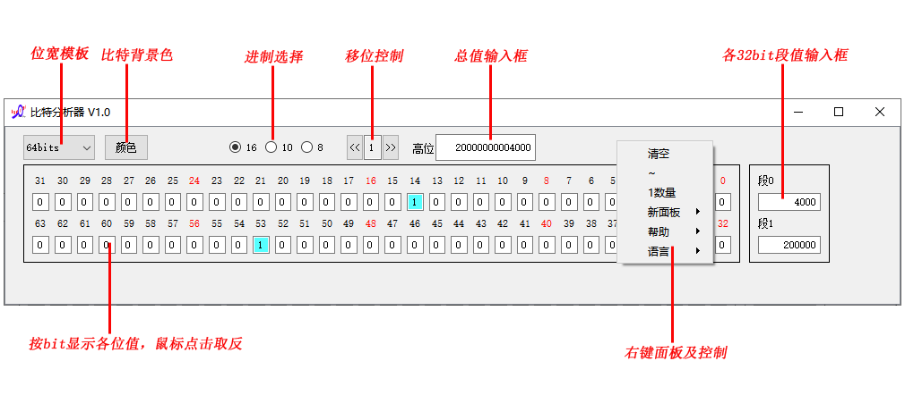
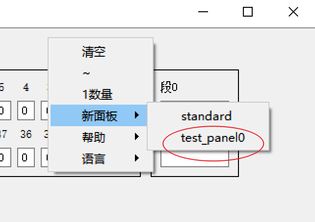
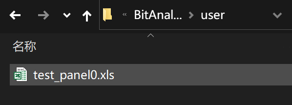
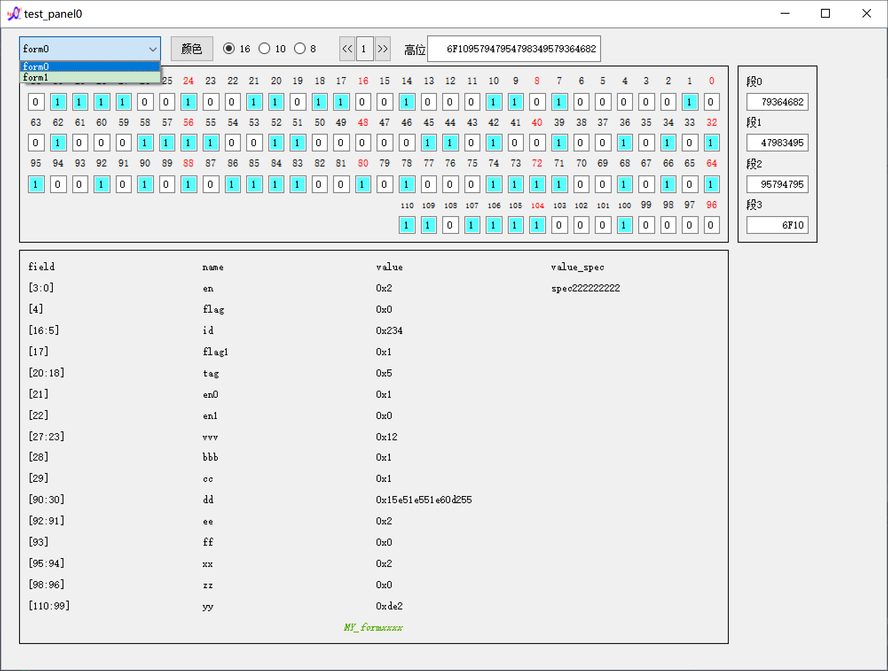
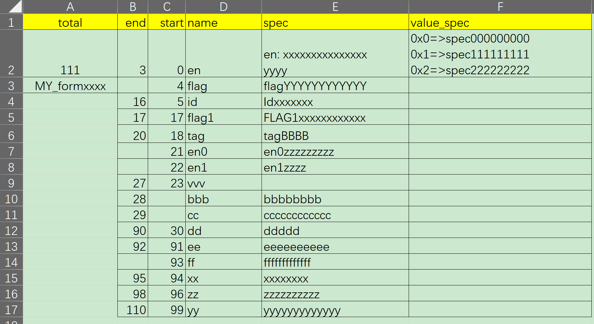
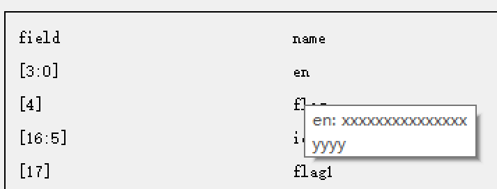

# 说明
+ 用于寄存器分析，比特流分析，数据结构分析。
+ 使用Python3+PyQt5实现。

## 特性
+ 支持32/64/128/256/512 bits模式；
+ 支持鼠标左键单击某bit，其值0/1反转；
+ 支持bit背景色选择；
+ 支持数值进制选择：16/10/8；
+ 支持向左/向右移位操作，每次移位的数值可修改；
+ 支持总值输入框，支持各32bit域段值输入框；
+ 支持鼠标右键：清空、取反、数1的数量；
+ 支持鼠标右键：新面板选择；
+ 支持鼠标右键帮助、语言选择；

## 新面板选择
+ 鼠标右键->新面板->（选择）

+ standard面板是默认的标准面板（启动面板）
+ 红圈部分是用户可自定义的面板，这里起始是工具路径user目录下的电子表格文件名：

+ 用户可以将自定义的模板表格放在该目录。先看一下效果：

+ 用户自定义模板支持域段自动拆分及数值含义解析
+ 看一下工具提供的user/test_panel0.xls，其sheet的名字作为”位宽模板“选项

+ 看一下示例form0表格的内容：

+ 第一行依次为：total/end/start/name/spec/value_spec
  - total: 在A2单元格填入总bit数量；
  - end/start: 按行填入各个域段的结束bit和起始bit；
  - name: 按行填入各个域段的命名；
  - spec: 按行填入命名的含义，该含义回在鼠标指向面板域段名是悬浮显示；
  
  - value_spec: 按值填入该域段不同值时的含义，数值拆分解析时显示在面板中；
  
  - total的A3单元格填入的值会显示在面板最下边；
  
+ 

## 注
+ ready目录有打包好的windows版程序，可以直接下载使用。[download](./ready/BitAnalyzer.zip)
+ pyinstall打包的程序，杀毒软件可能误报，添加信任即可。
+ 不放心的话下载源码自己打包啊。
+ linux/Mac系统可以直接下载源码使用python运行main.py。

# 打包方法
+ 1、安装python3.6及以上
+ 2、pip install PyQt5
+ 3、pip install xlutils
+ 4、pip install pyinstaller
+ 5、pip install pywin32

## cmd:
+ git clone git@gitcode.net:weixin_37548620/bitanalyzer.git
+ cd bitanalyzer
+ run.bat

# 修改记录
+ 2022-05-01: V1.0 初始版本
+ 2022-07-23: V1.1 支持高分辨率修改
+ 